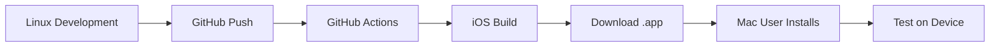

# 🍎 Alternative iOS Deployment Solutions (No Mac Required)

## ❌ Why Linux Can't Build iOS
- **iOS builds require Xcode** (macOS-only)
- **Apple toolchain** not available on Linux
- **Code signing** requires macOS environment
- **Simulator** only works on macOS

## ✅ Cloud-Based Solutions

### 1. 🌐 GitHub Actions (FREE)
**Already configured in `.github/workflows/ios-build.yml`**

**Setup:**
```bash
# Push to GitHub
git remote add origin https://github.com/YOUR_USERNAME/drivrr.git
git push -u origin main
```

**Benefits:**
- ✅ FREE (2000 minutes/month)
- ✅ Automatic builds on every push
- ✅ Download `.app` files as artifacts
- ✅ No Mac required

**Limitations:**
- ❌ Can't install directly on device
- ❌ Need to use Xcode for final installation

### 2. 🏗️ Codemagic (Professional)
**Already configured in `codemagic.yaml`**

**Setup:**
1. Sign up at [codemagic.io](https://codemagic.io)
2. Connect your GitHub repository
3. Configure Apple Developer certificates
4. Automatic builds and App Store deployment

**Benefits:**
- ✅ Complete CI/CD pipeline
- ✅ Direct App Store publishing
- ✅ TestFlight distribution
- ✅ Device installation

**Cost:** $0.95/build minute after free tier

### 3. ☁️ Remote Mac Services

#### MacinCloud
- **Rent macOS in the cloud**
- **$20-50/month**
- **Full macOS access**
- **Install Xcode and build directly**

#### AWS EC2 Mac Instances
- **Apple-approved cloud Macs**
- **$1.083/hour (dedicated)**
- **Professional development environment**

#### MacStadium
- **Dedicated Mac mini in the cloud**
- **$79/month**
- **Full control over macOS environment**

### 4. 🤝 Collaborative Solutions

#### Find a Mac User
- **Friend/colleague with Mac**
- **Transfer project via Git/USB**
- **Build and install for you**

#### Local Development Services
- **Hire freelancer with Mac**
- **One-time setup fee**
- **Future builds when needed**

## 🎯 RECOMMENDED APPROACH

### For Testing (FREE):
1. **Use GitHub Actions** for automatic builds
2. **Download artifacts** (`.app` files)
3. **Find Mac user** to install on device
4. **Test via TestFlight** (if you have Apple Developer account)

### For Production:
1. **Codemagic** for complete pipeline
2. **Automatic App Store deployment**
3. **Professional CI/CD workflow**

## 🔄 Hybrid Workflow



## 📱 What You Get

Even without a Mac, you can:
- ✅ **Build iOS apps** in the cloud
- ✅ **Generate .ipa files** for distribution
- ✅ **Publish to App Store** (via Codemagic)
- ✅ **Test via TestFlight** 
- ✅ **Professional deployment pipeline**

## 💡 Pro Tips

1. **Start with GitHub Actions** (free)
2. **Upgrade to Codemagic** when ready for production
3. **Consider renting a Mac** for intensive development
4. **Use TestFlight** for beta testing
5. **Partner with Mac developers** for collaboration

---

**🎉 Your iOS deployment is ready to go! Choose the solution that fits your budget and needs.**
